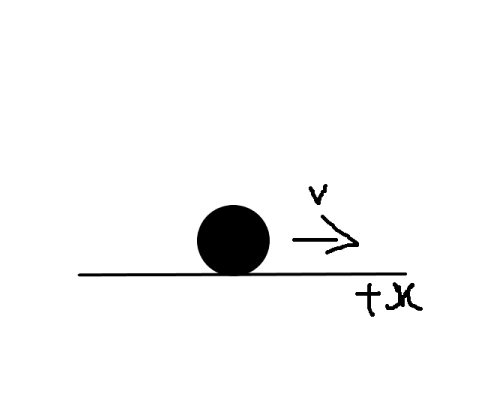
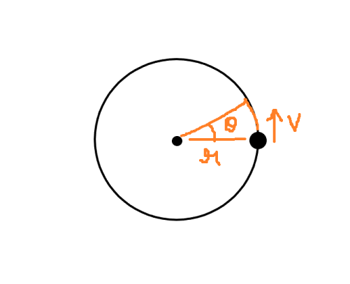

Linear and angular momentum are always conserved, but can we use something like Lagrangian Mechanics to derive that result?

|  | 
|:--:| 
| A spinning top, a very interesting object of study for physicists. Momentum conservation can be derived by analyzing its behavior. (Credit: https://wallpaperscraft.com/) |

# Post Details

- Purpose: notes, will be made into a full blog post later.
- Difficulty: intermediate.
- Prerequisites: Calculus and Analytical Geometry, some familiarity with the Lagrangian formulation of Classical Mechanics.

# Introduction

Momentum is one of those special quantities in physics that is always conserved -- In a physical system, the total momentum over any period of time is always the same when there are no external forces acting on it. This is akin to the law of energy conservation, and these conservation laws represent an underlying symmetry of nature and are the bedrocks of all the physics we have today.

In this post, I aim to derive the relation for conservation of linear and angular momentum by applying Lagrangian Mechanics to one-dimensional motion and circular motion.

# The Lagrangian

We start by introducing the Lagrangian $$L$$, a function that characterizes the state of a system. The Lagrangian is defined as the difference between the kinetic and potential energies of a system:

$$ 
  L = T - V
$$

Where $$ T $$ and $$ V $$ are the total kinetic and potential energies of the body/system.

The Lagrangian is a function of (generalized) position $$ q_i $$, (generalized) velocity $$ \dot{q}_i $$, and time:

$$
  L = L(q_i, \dot{q}_i, t)
$$

Whereas the potential energy $$ V $$ is usually only a function of (generalized) position $$ q_i $$ and more familiarly, is related to force as a spatial gradient in the Newtonian formalism:

$$
  \begin{align*}
    V &= V(q_i) \\
    \vec{F} &= - \nabla V
  \end{align*}
$$

When working in Cartesian coordinates, the generalized coordinates $$ q_i $$ are the familiar $$ x $$, $$ y $$, and $$ z $$:

$$
  (q_1, q_2, q_3) = (x, y, z)
$$

And when working in Polar/Cylindrical, the generalized coordinates are the radius $$ r $$, angle $$ \theta $$, and elevation $$ z $$:

$$
  (q_1, q_2, q_3) = (r, \theta, z)
$$

The Euler-Lagrange equation for finding the stationary points of the path integral of the Lagrangian over time (the action) is:

$$
  \frac{d}{dt}\frac{\partial L}{\partial \dot{q}} = \frac{\partial L}{\partial q}
$$

Where $$ q $$ is our usual generalized displacement.

# Linear Momentum Conservation - A Rolling Ball

We begin by looking at a classic and simple physical system - a rolling ball. We shall restrict ourselves to just one dimension as the higher dimensional cases are a natural extension that can be arrived at by repeating the same calculations. We assume no air resistance and friction of any sort.

The system is as follows: a ball at rest is subjected to a force initially that causes it to roll smoothly along a frictionless surface:

The Lagrangian for the ball's motion can then be written in terms of its classical kinetic energy and the potential energy:

$$
  \begin{align*}
    L &= T - V \\
      &= \frac{1}{2}mv^2 - V(x)
  \end{align*}
$$

We rewrite the velocity in terms of its components, which here trivially turns out to be the time derivative of the displacement (and our coordinate) $$ x $$:

$$
  L = \frac{1}{2}m\dot{x}^2 - V
$$

The lack of resistive forces like air resistance or friction means that during the motion, there is no force acting on the ball so the potential energy is constant - recall that force is a spatial derivative of potential energy:

$$
  \vec{F} = -\nabla V
$$

So if the force is zero, the rate of change of potential energy with respect to the displacement $$ x $$ will be zero, thus the potential energy itself will be constant:

$$
  \begin{align*}
    -\nabla V &= 0 \\
    \frac{\partial V}{\partial x} &= 0 \\
    V &= \text{const.}
  \end{align*}
$$

In the presence of force fields, this is the same as moving along equipotential lines of the force.

A constant potential term means that the partial derivatives of $$ V $$ with respect to $$ \dot{x} $$ and $$ x $$ is then $$ 0 $$:

$$
  \frac{\partial V}{\partial x} = \frac{\partial V}{\partial \dot{x}} = 0
$$

Now it's time to apply Euler-Lagrange here, so let's first find the partial derivatives w.r.t the $$ x $$ coordinate:

$$
    \begin{align*}
      \frac{\partial L}{\partial \dot{x}} &= m \dot{x} \\
      \frac{\partial L}{\partial x} &= 0
    \end{align*}
$$

Plugging this into the Euler-Lagrange,

$$
  \begin{align*}
    \frac{d}{dt} \frac{\partial L}{\partial \dot{x}} &= \frac{\partial L}{\partial x} \\
    \frac{d}{dt} (m\dot{x}) &= 0
  \end{align*}
$$

And pause. Let's look at the result that we have here. The equation is basically saying that the time derivative of the quantity inside the parenthesis is 0, meaning that whatever quantity that is, it does not change over time.

But what quantity is it? Recall that the time derivative of displacement is velocity:

$$
  \because \frac{dx}{dt} = \dot{x} = v
$$

So rewriting our result, we get:

$$
  \frac{d}{dt} (mv) = 0
$$

Voilà, conservation of linear momentum!

# Angular Momentum Conservation - Circular Motion

Linear momentum was cute and simple, let's amp it up a notch. Let's try to see if we can derive conservation for angular momentum in the same way by applying the same techniques to a system undergoing circular motion.

The system is as follows: a particle at rest is subjected to a torque which causes it to orbit around a point in space with a velocity as follows:

A circle is two-dimensional, so we can no longer operate in just the one-dimensional $$ x $$ coordinate for our physical quantities. We have to work in two dimensions.

Most importantly, angular motion is described in terms of the angle of revolution and the radial distance, which in coordinates correspond to the radial and angular coordinate, so the best thing to do is to convert the Lagrangian from Cartesian to Polar coordinates.

**The transformation will be the most mathematically intense part of this entire post, so I will not detail too much of what's happening and you can skip over it. We only really need the result in the end anyway.**

# Transforming the Lagrangian from Cartesian to Polar

We begin by writing the Lagrangian in terms of the Cartesian coordinate velocities:

$$
  L = \frac{1}{2}m(\dot{x}^2 + \dot{y}^2) - V
$$

The coordinate transformations from Cartesian to Polar is:

$$
  \begin{align*}
    x &= r \cos \theta \\
    y &= r \sin \theta
  \end{align*}
$$

Taking time derivatives on both sides,

$$
  \begin{align*}
    \dot{x} &= \dot{r} \cos \theta - r \dot{\theta} \sin \theta \\
    \dot{y} &= \dot{R} \sin \theta + r \dot{theta} \cos \theta
  \end{align*}
$$

Squaring each equation and taking their sum,

$$
  \begin{align*}
    \dot{x}^2 &= \dot{r}^2 \cos^2 \theta + r^2 \dot{\theta}^2 \sin^2 \theta - 2 r \dot{r} \dot{\theta} \cos \theta \sin \theta \\
    \dot{y}^2 &= \dot{r}^2 \sin^2 \theta + r^2 \dot{\theta}^2 \cos^2 \theta + 2 r \dot{r} \dot{\theta} \cos \theta \sin \theta \\
    \hrule \\
    \dot{x}^2 + \dot{y}^2 &= \dot{r}^2 \cos^2 \theta + \dot{r}^2 \sin^2 \theta + r^2 \dot{\theta}^2 \sin^2 \theta + r^2 \dot{\theta}^2 \cos^2 \theta
  \end{align*}
$$

Factoring like terms and using the sine-cosine Pythagorean identity,

$$
  \begin{align*}
    \dot{x}^2 + \dot{y}^2 &= \dot{r}^2 (\cos^2 \theta + \sin^2 \theta) + r^2 \dot{\theta}^2(\sin^2 \theta + \cos^2 \theta) \\
    &= \dot{r}^2 + r^2 \dot{\theta}^2 \\
    &= (\dot{r})^2 + (r \dot{\theta})^2
  \end{align*}
$$

And there you have it, the coordinate velocity transformation is now complete. Putting this into the Lagrangian,

$$
  L = \frac{1}{2}m \left( \dot{r}^2 + r^2 \dot{\theta}^2 \right) - V
$$

Perfect, now since we're working in the Polar coordinate system, our coordinates are the radial and angular coordinates:

$$
  (q_1, q_2) = (r, \theta)
$$

Now, similar to the situation in the rolling ball system, we don't have resistive forces that contribute to an external force or torque so the potential term $$ V $$ is a constant. Thus, the partials of the potential energy w.r.t the angular coordinate $$ \theta $$ are $$ 0 $$:

$$
  \frac{\partial V}{\partial \theta} = \frac{\partial V}{\partial \dot{\theta}} = 0
$$

Let's apply Euler-Lagrange to our Polar Lagrangian above, starting with the angular coordinate $$ \theta $$. Let's find the partials first,

$$
  \begin{align*}
    \frac{\partial L}{\partial \dot{\theta}} &= \frac{\partial}{\partial \dot{\theta}} \left(\frac{1}{2}m \left( \dot{r}^2 + r^2 \dot{\theta}^2 \right) - V  \right) \\
    &= mr^2 \dot{\theta} \\
    \frac{\partial L}{\partial \theta} &= \frac{\partial}{\partial \theta} \left(\frac{1}{2}m \left( \dot{r}^2 + r^2 \dot{\theta}^2 \right) - V  \right) \\
    &= 0
  \end{align*}
$$

Even by just eyeballing these partials, you can see the same pattern that we saw in the rolling ball system begin to emerge. We're not done yet, the Euler-Lagrange is due:

$$
  \begin{align*}
    \frac{d}{dt} \frac{\partial L}{\partial \dot{\theta}} &= \frac{\partial L}{\partial \theta} \\
    \frac{d}{dt} (mr^2 \dot{\theta}) &= 0
  \end{align*}
$$

And we've arrived at the famous result! If it's not obvious, then similar to what we did in the linear momentum section, let's work out what the quantity in parenthesis is.

We know that the time derivative of the angle is the angular velocity $$ \omega $$,

$$
  \omega = \dot{\theta} = \frac{d \theta}{dt}
$$

We also know that velocity $$ v $$ is the time derivative of the displacement $$ s $$, and displacement here is the arc length of the circular path traced out the particle. So doing some elementary calculus:

$$
  \begin{align*}
    v &= \frac{ds}{dt} \\
    \because s &= r \theta \\
    v &= \frac{d(r \theta)}{dt} \\
      &= \frac{\theta dr + r d\theta}{dt} \\
      &= \theta \dot{r} + r \dot{\theta}
  \end{align*}
$$

Now, we know that the time derivative of angle is angular velocity, and in our system of simple circular motion, the radius never changes, so the radial change term ends up being zero, which causes the expression to boil down to:

$$
  v = 0 + r \omega = r \omega
$$

Or,

$$
  \omega = \frac{v}{r}
$$

Let's use these relations we just derived in the result we obtained from the Lagrangian:

$$
  \begin{align*}
    \frac{d}{dt}(mr^2 \dot{\theta}) &= 0 \\
    \frac{d}{dt}(mr^2 \omega) &= 0 \\
    \frac{d}{dt}(mr^2 \frac{v}{r}) = 0 \\
    \frac{d}{dt}(mvr) = 0
  \end{align*}
$$

Voilà yet again, conservation of angular momentum!

In summary, this is a classic derivation of one of the many important conservation laws of physics. This one states that when there are no forces and torques acting on a system, the total linear and angular momentum are conserved, and we have shown that.

---

Thank you for reading! You can also find me at other places like Quora, Medium, and GitHub:

https://www.quora.com/profile/Baalateja-Kataru
https://physicsscribbles.quora.com/
https://medium.com/physics-scribbles
https://github.com/BK-Modding

